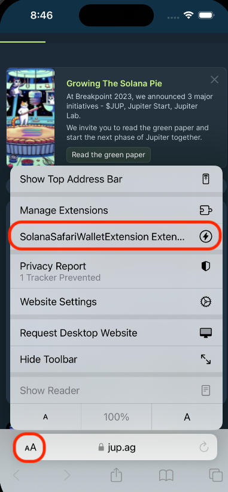
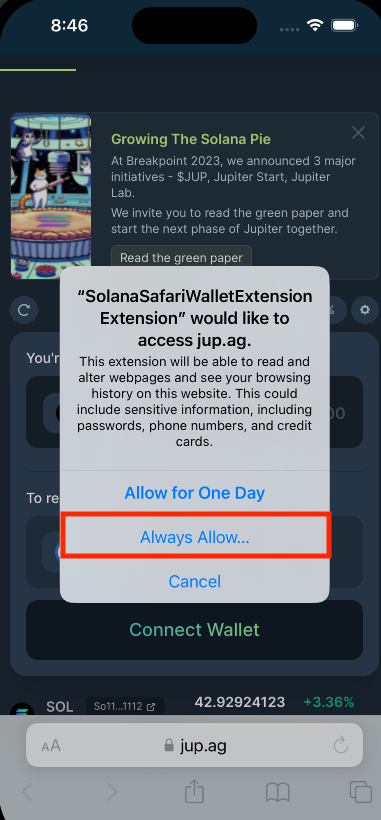
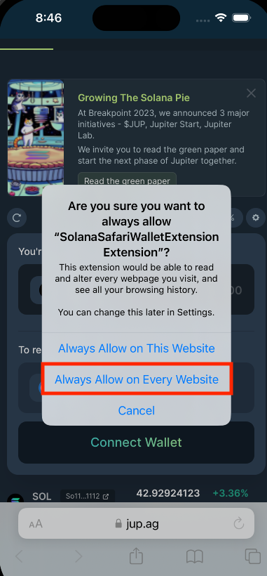
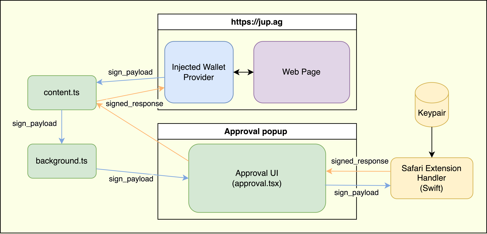

# Safari Web Extension Wallet for iOS

> This repository showcases an example iOS wallet that utilizes a **Safari Web Extension** to enable wallet signing within the Safari browser.
> This is a proof of concept and its implementation of key storage is unencrypted and should not be replicated in a real wallet.

## Demo

[Video](https://github.com/Michaelsulistio/SolanaSafariWalletExtension/assets/18451967/b40ce3e3-33bb-4c60-9486-4b34f8db0076) of a Jupiter Exchange swap

<div style="display: flex;">
    
    &nbsp;
    &nbsp;
</div>

## Installation

1. Download [Xcode](https://developer.apple.com/xcode/)
2. Build the Extension's JS bundle: `cd js-extension && npm install && npm run build:publish`
3. Follow the "Enable App Groups" steps below.
4. Open the project in Xcode, choose your simulator/device, build and run.

## Enable App Groups

In order for the Safari Extension to read the same `UserDefaults` or Keychain as the iOS app, they need to use a shared [App group](https://developer.apple.com/documentation/xcode/configuring-app-groups).

1. In Xcode, select the project > Signing & Capabilities > App Groups
2. At the bottom, add an App Group identifier.

<div style="display: flex;">
    
</div>

<br />

3. In `/Shared/KeypairUtil.swift`, edit the `sharedUserDefaults()` function to use your app group identifier.

```swift
func sharedUserDefaults() -> UserDefaults? {
    return UserDefaults(suiteName: "group.your.app")
}
```

Now your native app and extension handler can read and write to the same UserDefaults!

## Enable the extension

1. In Safari, press the _Aa_ menu and click _Manage Extensions_
2. In the extensions list, find the name, "Solana Safari Extension Wallet", and enable it.
3. Back in the _Aa_ menu, press new "Solana Safari Extension Wallet" button.
4. Select "Always allow" then "Always allow on every website".

<div style="display: flex;">
    
    &nbsp;
    &nbsp;
</div>

## Folder Reference

`js-extension`: All the JS in the web extension is built from this directory (i.e Approval UI, page/content/background scripts, wallet standard, etc). The JS is bundled into raw minified `.js` scripts which are exported to the Safari Extension folder with `npm run build:publish`.

`js-extension/Approval`: React components and logic for the Approval Popup UI.

`SolanaSafariWalletExtension Extension`: The **Safari Web Extension** Swift code. This contains the bundled `js` and `html` from the `js-extension` folder and also the _Extension handler_ code, which acts as a bridge between JS and the native app.

`SolanaSafariWalletExtension`: The native iOS wallet app built with SwiftUI.

## What is a Safari Web Extension?

A [Safari Web Extension](https://developer.apple.com/documentation/safariservices/safari_web_extensions) allows an iOS app to add customized functionality to
the Safari mobile browser. Similar to a Chrome browser extension, the Safari Web Extension can run background/content scripts and inject javascript into the web page.

The **key benefit** of the web extension on mobile is that it is able to communicate with the native iOS app, relay information to the web page, and render a bottom sheet pop up for
a no-context switch signing experience.

## Wallet Standard

Just like Chrome extension wallets, this uses [Wallet-standard](https://github.com/solana-labs/wallet-standard/tree/master) to subscribe and respond to requests from the dApp. It is automatically compatible with existing Solana web dApps.

## Example: Connect Request Flow

1. On page load, the JS extension injects a page script (`injected.ts`) that registers the wallet implementation to `window` using Wallet-standard's `registerWallet`.

2. When a standard _Connect_ event is emitted, the wallet provider (`provider.ts`) relays it to the Extension's _content script_ (`content.ts`) with `window.postMessage`.

3. The _content script_ forwards this message to the Extension's _background script_ (`background.ts`) using ` browser.runtime.sendMessage`.

4. The _background script_ initializes the Approval UI (`approval.tsx`) using `browser.action.openPopup()` API.

5. The Approval UI is able to communicate and fetch necessary data from the native app with `browser.runtime.sendNativeMessage`.

6. On approve, the Approval UI tab sends the connect response back to the page with `browser.tabs.sendMessage(originTabId, response)`.

## Architecture Diagrams

### App + Extension Diagram


### JS Extension Diagram


